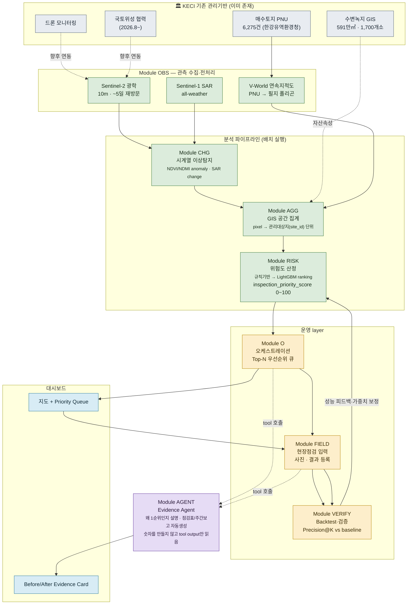
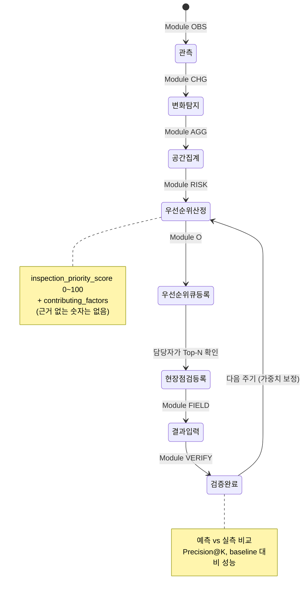
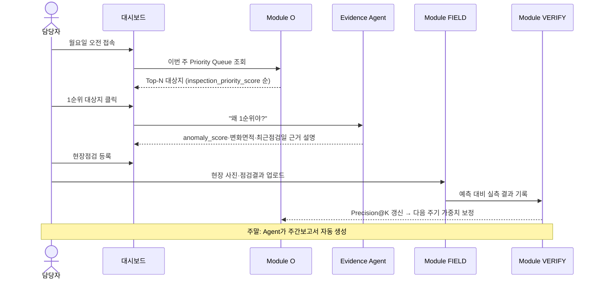

# 수변가드 AI (Waterside Guard)

한국환경보전원(KECI)이 관리하는 전국 수변녹지·매수토지 중 **오늘 현장직원이 먼저 가봐야 할 곳**을 위성 변화탐지 + GIS 위험도 점수로 자동 산출하고, 현장점검 결과를 다시 데이터로 환류시켜 수변녹지 관리의 전 과정을 잇는 의사결정지원 시스템.

> 이 리포에서 작업을 시작하는 모든 사람(사람이든 Claude Code 세션이든)은 이 README를 먼저 읽을 것. 더 상세한 모듈 계약·Backtest 전략·로드맵은 **[ARCHITECTURE.md](ARCHITECTURE.md)**가 정본(SoT)이다. 원본 리서치·핸드오프 브리프는 [`docs/`](docs/)에 있다.

**2026년 한국환경보전원 대국민 환경혁신 아이디어 공모전**(부제: 환경을 잇다, 미래를 잇다) 제출용 프로토타입. 접수 2026.9.1.~9.30. 18:00.

---

## 한 줄 요약

> "전국을 보는 시스템"이 아니라 **"담당자가 내일 어디를 먼저 가야 하는지 알려주는 시스템"**.

한국환경보전원은 이미 약 591만㎡·1,700여 개소의 수변녹지를 GIS로 구축했고, 매수토지 현장 확인에 드론을 운용하며, 2026년 8월부터 국토지리정보원과 국토위성 협력을 시작했다. **데이터는 이미 있다.** 없는 것은 "많은 공간자산과 다양한 영상 중 어느 곳을 먼저 사람이 확인해야 하는지 결정하는" 운영 layer다. 수변가드는 그 마지막 단계만 새로 제안한다 — 새 위성 플랫폼이 아니다.

왜 이 방향이 가장 방어력이 높은지, 왜 Agent를 전면에 내세우지 않는지, 왜 DNN을 처음부터 쓰지 않는지는 [ARCHITECTURE.md §0](ARCHITECTURE.md#0-프로젝트-배경--왜-이걸-만드는가-반드시-먼저-읽을-것)에 있다.

---

## 아키텍처 다이어그램

### 전체 시스템 — KECI 기존 기반 위에 얹는 8개 모듈



`K3`(드론)·`K4`(국토위성)는 실제 기관 도입 단계에서 연결하는 확장 경로다. 공모전 프로토타입은 `O1`(Sentinel-2)·`O2`(Sentinel-1)·`O3`(V-World 공개 API)만으로 완성한다 — 전문은 [ARCHITECTURE.md §3](ARCHITECTURE.md#3-데이터-스택).

### 7단계 상태머신 (관리대상지 1건 기준)



담당자 승인 게이트는 없다 — 재난 대응형 시스템이 아니므로 "현장점검을 실제로 갈지 말지" 판단 자체가 이미 human-in-the-loop이다. 전문은 [ARCHITECTURE.md §2.1](ARCHITECTURE.md#21-7단계-상태머신).

### 사용자 시나리오 — 월요일 아침 담당자의 하루



---

## 모듈 요약

| 모듈 | 역할 | 핵심 출력 |
|---|---|---|
| **OBS** | Sentinel-2/1, V-World 연속지적도 수집·전처리 | 위성 composite, PNU 폴리곤 |
| **CHG** | 시계열 대비 이상변화 탐지 (종 판독 아님, "달라졌다"까지만) | `anomaly_score`, `changed_area_ratio` |
| **AGG** | pixel → 관리대상지(`site_id`) 단위로 GIS 집계 | 대상지별 feature 벡터 |
| **RISK** | 규칙기반(1단계) → LightGBM ranking(2단계, label 확보 후) | `inspection_priority_score`(0~100) + `contributing_factors`(근거) |
| **O** | Top-N 우선순위 큐 생성·상태 관리 | `priority_queue` |
| **FIELD** | 현장점검 사진·결과 입력 | `inspection_id` |
| **VERIFY** | 예측 vs 실측 backtest, baseline 비교 | `Precision@K`, `Recall@Top20%` |
| **AGENT** | 위 모듈들의 tool output을 읽어 자연어로 설명·보고서 생성 (숫자를 만들지 않음) | 점검표, 주간보고서 |

전체 모듈 입출력 계약(예시 JSON)은 [`contracts/`](contracts/) 및 [ARCHITECTURE.md §5](ARCHITECTURE.md#5-모듈-계약--입출력-예시)에 있다. 모든 모듈은 공통 봉투(envelope) 규약 `{status, fallback_tier, data, warnings}`을 따른다 — [ARCHITECTURE.md §4](ARCHITECTURE.md#4-통합-규약-모든-모듈-필수-준수).

### 구현 상태 — Implemented / Experimental / Planned

> **"코드가 동작한다"와 "실제 성능이 검증됐다"는 다르다.** 예를 들어 Module VERIFY의 `Precision@K` 함수가 테스트를 통과한다는 건 *계산 코드가 맞다*는 뜻이지 *수변가드의 실제 탐지 정확도가 높다*는 뜻이 아니다. 아래 표는 그 구분을 명시한다.

| 기능 | 상태 | 근거 / 남은 것 |
|---|---|---|
| PNU → 필지 폴리곤 복원 (V-World) | ✅ Implemented | 한강유역 6,275건 중 5,526건 복원 |
| Sentinel-2 NDVI/NDMI 시계열 (GEE) | ✅ Implemented | 실제 관측치로 60개 site 처리 |
| Sentinel-1 SAR 변화 | ✅ Implemented | IW/VV 기간 합성, 광학 실패 시 단독 폴백까지 동작 |
| 픽셀 단위 변화면적 | ✅ Implemented | 60/60건 실측 성공, 실패 시 근사치 폴백을 `changed_area_ratio_source`로 구분 표시 |
| 수체 인접 여부 (JRC GSW) | ✅ Implemented | 60건 중 20건 인접 판정 |
| 최근 강우 (Open-Meteo) | ✅ Implemented | 신뢰도 confounder로도 사용 |
| 우선순위 점수 (rule_v1) | ✅ Implemented | 7요인 가중합 + 결측 재정규화. **가중치·임계값은 초기 가정치** |
| 증거 신뢰도 (`evidence_confidence`) | 🧪 Experimental | 판정 로직은 동작하나 **가중치가 label로 보정되지 않음** |
| 계절 정합 baseline (season-matched) | ✅ Implemented | 과거 3년 동일계절 median/MAD 대비 robust z. 50/50건 적용, 부족 시 두 기간 차분 폴백 |
| 점검예산 Top-N 시뮬레이터 | ✅ Implemented | 예산 설정 → 리스트·지도에 경계 반영. 예상 발견율은 **라벨이 있을 때만** 표시 |
| 현장점검 taxonomy (8종 + 보류) | ✅ Implemented | 오탐 원인(예초·계절변화)을 따로 받아 향후 label 기반 확보 |
| Ground Truth 라벨링 도구 | ✅ Implemented | 층화추출 후보 생성 + 판독 재수입 파이프라인 (`scripts/build_label_candidates.py`, `import_labels.py`) |
| Top-N 우선순위 큐 · 현장점검 입력 | ✅ Implemented | end-to-end 브라우저 검증 완료 |
| Precision@K / Recall@K 계산 엔진 | ✅ Implemented | 계산·leakage 가드 동작. **아래 항목과 구분할 것** |
| **실제 정확도 검증 (Ground Truth)** | ⏳ **Planned** | **현재 최대 약점** — 도구는 준비됐고 **사람의 독립 판독 50~100건이 남았다** |
| Evidence Agent (Gemini) | ✅ Implemented | 판정은 하지 않고 tool 결과 설명만 — 의도적으로 비중 축소 |
| LightGBM ranking / SHAP | ❌ 미구현 (의도적) | label이 충분히 쌓이기 전에는 만들지 않는다 |
| 전국 production 운영 | ❌ 미구현 (범위 밖) | 배치 아키텍처만 검증, 실제 배포는 파일럿 이후 |

---

## 데이터

| 데이터 | 내용 | 상태 |
|---|---|---|
| `hanriver_maesu_raw.csv` | 한강유역환경청 매수토지 전체 6,275행 (PNU/소재지/기준일, **좌표 없음**) | `data/raw/`에 배치 완료 |
| `yongin_yubang_maesu.csv` | 용인시 처인구 유방동 필터링 85행 — 삼성전자·한강유역환경청 협력 복원사업(약 33만㎡) 부지, 실증 앵커 | `data/raw/`에 배치 완료 |
| V-World 연속지적도 (`LP_PA_CBND_BUBUN`) | PNU → 필지 폴리곤 복원 | **유방동 82/85필지(96.5%) + 한강유역 전체 5,526/6,275필지(88.1%) 복원 완료** — `scripts/fetch_parcel_geometry.py` |
| Sentinel-2 | 광학 위성 시계열 (Google Earth Engine) | **실증 완료, 6개 시/군/구로 확대** — `module_obs/batch.py`(배치 조회, 이미지 수에만 비례하는 API 호출)로 60필지 처리 |

API 키는 사용자가 이미 보유하고 있다 — `.env`(git-ignore)에 채워 넣고 시작한다. **절대 코드에 하드코딩하지 않는다.** 상세는 [`.env.example`](.env.example), 데이터 스택 전문은 [ARCHITECTURE.md §3](ARCHITECTURE.md#3-데이터-스택).

### Ground Truth 라벨링 워크플로 (제출 전 최우선 과제)

현재 프로젝트의 단일 최대 약점은 **채점할 정답지가 없다**는 것이다. Module VERIFY의
Precision@K 함수가 테스트를 통과한다는 건 *계산 코드가 맞다*는 뜻이지 *실제 탐지
정확도가 높다*는 뜻이 아니다. 아래 3단계로 정답지를 만든다:

**현장에 갈 필요 없다.** 리서치가 권장한 주력 방법(Silver-A)은 현장 방문이 아니라
**고해상도 위성영상 판독**이다. 아래 3단계로 진행한다:

```bash
# 1) 판독 자료 생성 — 층화추출 + Esri Wayback 시기별 실사 영상(필지 경계 표시)
python scripts/build_label_candidates.py --n 60

# 2) data/labels/review/index.html 을 브라우저로 열어 판독
#    필지별로 4개 시기 영상이 나란히 뜨고, 판정/변화유형을 고른 뒤 CSV로 내려받는다
#    → 가능하면 2명이 독립 판독하고 불일치 건만 재검토

# 3) 판독 결과를 label_candidates.csv 에 옮긴 뒤 시스템에 반영
python scripts/import_labels.py --dry-run   # 검증만
python scripts/import_labels.py             # 저장 → api_server 재시작 시 Backtest가 채점
```

**왜 NDVI가 아니라 Esri Wayback 실사 영상인가**: (1) NDVI로 판독하면 알고리즘이 쓴 신호를
사람이 다시 확인하는 **순환논리**가 된다. (2) Sentinel-2는 10m/픽셀인데 필지 중앙값이
883㎡(약 3×3 픽셀), 최소 4㎡라 **육안 판독이 물리적으로 불가능**하다. Wayback은 서브미터급
실사 영상을 시기별로 제공해 두 문제를 동시에 해결한다.

**계절 차이 함정에 대한 대응**: Wayback의 날짜는 배포일이지 촬영일이 아니어서(Esri가 촬영일을
공개하지 않는다) 어떤 시기는 여름, 어떤 시기는 휴면기 영상이다. 그래서 판독 지침을
**"구조적 변화만 판정하고, 초록↔갈색 차이는 `natural_seasonal`(오탐)로 기록"**으로 못박았다.
이건 타협이 아니라 오히려 더 나은 정답지다 — 우리 모델의 알려진 약점이 계절 오탐인데,
사람이 "이건 계절 변화일 뿐"이라고 표시해주면 그 오탐이 Precision@K에 그대로 잡힌다.

**왜 층화추출인가**: 점수 상위만 라벨링하면 Precision@K는 재도 **Recall은 못 잰다**(하위
구간에 실제 변화가 얼마나 숨어 있는지 모르므로). 상위·중위·하위에서 고루 뽑아야
"상위 20%만 봤을 때 전체 변화의 몇 %를 잡았는가"라는 핵심 지표를 계산할 수 있다.

**판독 라벨 ≠ 현장점검**: 영상 판독은 현장 방문보다 약한 근거라, `label_source:
"image_review"`로 표시해 나중에 섞이지 않게 한다.

**현재 가장 큰 한계**: 실제 현장 라벨(Ground Truth)이 없어 Precision@K 같은 정확도를 아직 실측하지 못했다 — 검증 엔진(Module VERIFY)은 구현돼 있지만 채점할 정답지가 없는 상태다. 그다음 한계는 `site_attributes` 중 복원경과일·최근점검일·과거이상이력이 KECI 내부 자산 DB에서 와야 하는데 접근할 방법이 없다는 점이다(인접수계여부·최근강우는 공개 데이터로 해결됨). 결측 요인은 가중치를 빼고 재정규화하므로 점수가 구조적으로 눌리지는 않지만, `weight_coverage`로 "전체 근거의 75%만 확보된 점수"임을 항상 함께 표시한다 — 자세한 내용은 [ARCHITECTURE.md §13 "알려진 한계"](ARCHITECTURE.md#13-세션-브리핑--다음에-이-리포를-여는-claude-code-세션에게).

---

## 저장소 구조

```
README.md                  # 이 파일
ARCHITECTURE.md             # 아키텍처 확정안 v1.0 — 정본(SoT)
docs/                        # 원본 리서치 PDF, 핸드오프 브리프
contracts/                   # 모듈별 입출력 예시 JSON (= ARCHITECTURE.md §5)
common/                       # envelope·좌표변환 등 전 모듈 공유 유틸
module_obs/                   # Module OBS — Google Earth Engine (Sentinel-2), batch.py=배치 조회, thumbnail.py=NDVI 이미지
module_chg/                   # Module CHG — 변화탐지 (OBS 두 번 호출·이상도 계산)
module_agg/                   # Module AGG — CHG 결과 + 대상지 속성 집계
module_risk/                  # Module RISK — 규칙기반 inspection_priority_score 산정
module_o/                     # Module O — 우선순위 큐 + 상태머신(store.py)
module_field/                 # Module FIELD — 현장점검 입력 검증
module_verify/                 # Module VERIFY — Precision@K·Recall@K·baseline 비교
module_agent/                  # Module AGENT — Gemini Q&A + 주간보고서
  tests/                        # pytest, 모듈별 독립 실행 가능
api_server.py                  # FastAPI — /sites, /priority-queue, /inspections 등
tests/                          # api_server.py 통합 테스트
ui/                              # Next.js + MapLibre 대시보드 (ui/README.md 참조)
data/
  raw/                        # 원본 CSV (가공하지 않음)
  processed/                  # PNU→폴리곤, Priority Queue 등 가공 결과
scripts/                      # 파이프라인 스크립트 (Milestone별)
```

실행:

```bash
pip install -r requirements.txt
python -m pytest -v   # .env가 있으면 라이브 GEE 테스트까지 실행(conftest.py가 자동 로드)

# 실제 유방동 필지로 OBS→CHG→AGG→RISK 전체 파이프라인 실행
PYTHONPATH=. python scripts/run_priority_queue_demo.py --limit 10

# 다른 시/군/구로 확대 — site당 개별 호출이 아니라 배치(reduceRegions)로 처리
PYTHONPATH=. python scripts/run_priority_queue_batch.py --per-region 10

python -m uvicorn api_server:app --port 8001   # http://127.0.0.1:8001/priority-queue (두 결과 모두 서빙)

# 대시보드(다른 터미널)
cd ui && npm install && npm run dev
```

---

## 로드맵 (요약)

| 기간 | 목표 |
|---|---|
| 8/29 | **Data MVP 완료** — 유방동 82/85 + 한강유역 5,526/6,275필지 폴리곤 복원·검증 |
| 8/29 | **Module OBS·CHG·AGG·RISK 전부 실증 완료** (조기 착수, Google Earth Engine) — 유방동 실제 필지 10건으로 end-to-end 파이프라인·Priority Queue 생성까지 확인 |
| 9/19–9/22 | **Module O·FIELD·API 서버·대시보드 UI 전부 완료** (조기 착수) — 지도 클릭→Evidence Card→현장점검 등록→Priority Queue 갱신까지 실제 브라우저에서 확인 |
| 9/23–9/27 | **Module VERIFY·AGENT 전부 완료 + 실증 끝** (조기 착수) — Precision@K·Recall@Top20%·baseline 비교·data leakage 가드, `GET /verify/backtest`. `gemini-3.6-flash`로 Q&A(`/sites/{id}/ask`)·주간보고서(`POST /reports/weekly`) 실제 응답 확인 |
| — | **8개 모듈 + API 서버 + UI 전부 완료·실증** — GEE·Gemini 둘 다 실제 API 키로 검증 |
| — | **6개 시/군/구로 확대**(2026-08-29, 사용자 지적 반영) — 유방동만 보던 것을 양평군·가평군·광주시·남양주시·여주시까지 확대, `module_obs/batch.py`로 API 호출을 site 수가 아니라 이미지 수에만 비례하게 개선 |
| — | **Before/After NDVI 위성 이미지 추가**(2026-08-29, 사용자 지적 반영) — "왜 위성지도인가"에 답하기 위해 실제 NDVI 컬러 이미지를 Evidence Card와 지도 위 선택 위치에 표시(`module_obs/thumbnail.py`, `GET /sites/{id}/thumbnails`, on-demand). 남은 건 §11.3 Red-Team 리허설과 제출 준비 |
| 9/28–9/30 | Red-Team 방어 리허설, 제출본 Lock, 제출 |

전체 로드맵과 각 마일스톤의 완료 기준은 [ARCHITECTURE.md §12](ARCHITECTURE.md#12-개발-로드맵).

---

## 기술 스택 (예정)

FastAPI + GeoPandas(백엔드·GIS 분석) · PostGIS(공간 DB) · Next.js + MapLibre(프론트·지도) · LightGBM(2단계 위험도 모델, label 확보 후) · [`PublicDataReader`](https://github.com/WooilJeong/PublicDataReader)(V-World 연동).

내부 분석·저장 좌표계는 EPSG:5179(한국 UTM-K), 웹 지도 출력 직전에만 EPSG:4326으로 재투영한다. 전 모듈이 따르는 공통 봉투(envelope) 규약·폴백 계층은 [ARCHITECTURE.md §4](ARCHITECTURE.md#4-통합-규약-모든-모듈-필수-준수).

---

## 참고 벤치마크

이 리포의 envelope 규약·폴백계층·모듈 계약 패턴은 [tradeprogram/Aquaguard](https://github.com/tradeprogram/Aquaguard)(재해연쇄·골든타임 대응 에이전트)에서, 검증배지·데이터 출처 공시 패턴은 [tradeprogram/policymaps](https://github.com/tradeprogram/policymaps)(자치법규 정책지도)에서 가져왔다.

---

## 라이선스 / 출처

수집·가공하는 공공데이터(한강유역환경청 매수토지, V-World, Sentinel Copernicus)의 원 권리는 각 제공기관에 있다. 화면에는 항상 데이터 출처와 처리 방식(§ARCHITECTURE.md §9 불확실성 표기 원칙)을 명시한다.
