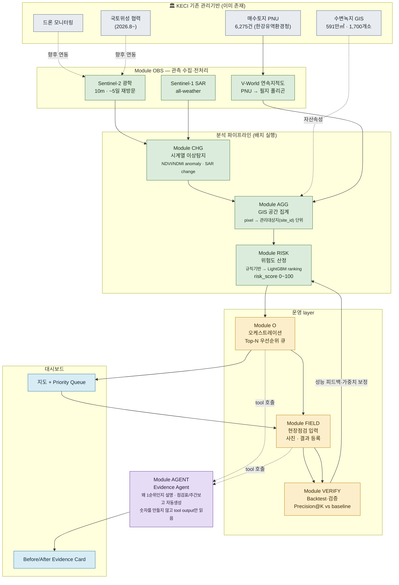
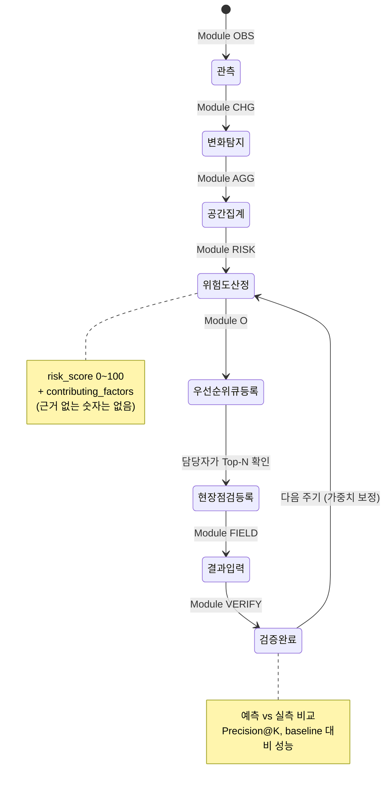
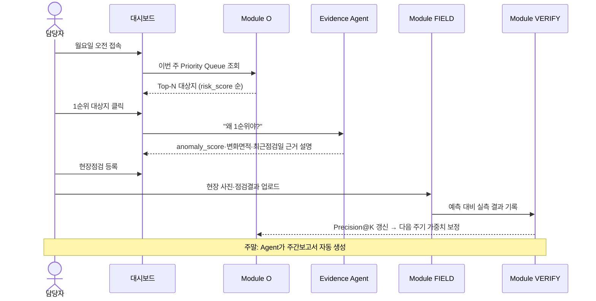

# 수변가드 AI (Waterside Guard)

한국환경보전원(KECI)이 관리하는 전국 수변녹지·매수토지 중 **오늘 현장직원이 먼저 가봐야 할 곳**을 위성 변화탐지 + GIS 위험도 점수로 자동 산출하고, 현장점검 결과를 다시 데이터로 환류시켜 수변녹지 관리의 전 과정을 잇는 의사결정지원 시스템.

> 이 리포에서 작업을 시작하는 모든 사람(사람이든 Claude Code 세션이든)은 이 README를 먼저 읽을 것. 더 상세한 모듈 계약·Backtest 전략·로드맵은 **[ARCHITECTURE.md](ARCHITECTURE.md)**가 정본(SoT)이다. 원본 리서치·핸드오프 브리프는 [`docs/`](docs/)에 있다.

**2026년 한국환경보전원 대국민 환경혁신 아이디어 공모전**(부제: 환경을 잇다, 미래를 잇다) 제출용 프로토타입. 접수 2026.9.1.~9.30. 18:00.

---

## 한 줄 요약

> "전국을 보는 시스템"이 아니라 **"담당자가 내일 어디를 먼저 가야 하는지 알려주는 시스템"**.

한국환경보전원은 이미 약 591만㎡·1,700여 개소의 수변녹지를 GIS로 구축했고, 매수토지 현장 확인에 드론을 운용하며, 2026년 8월부터 국토지리정보원과 국토위성 협력을 시작했다. **데이터는 이미 있다.** 없는 것은 "많은 공간자산과 다양한 영상 중 어느 곳을 먼저 사람이 확인해야 하는지 결정하는" 운영 layer다. 수변가드는 그 마지막 단계만 새로 제안한다 — 새 위성 플랫폼이 아니다.

왜 이 방향이 가장 방어력이 높은지, 왜 Agent를 전면에 내세우지 않는지, 왜 DNN을 처음부터 쓰지 않는지는 [ARCHITECTURE.md §0](ARCHITECTURE.md#0-프로젝트-배경--왜-이걸-만드는가-반드시-먼저-읽을-것)에 있다.

---

## 아키텍처 다이어그램

### 전체 시스템 — KECI 기존 기반 위에 얹는 8개 모듈



`K3`(드론)·`K4`(국토위성)는 실제 기관 도입 단계에서 연결하는 확장 경로다. 공모전 프로토타입은 `O1`(Sentinel-2)·`O2`(Sentinel-1)·`O3`(V-World 공개 API)만으로 완성한다 — 전문은 [ARCHITECTURE.md §3](ARCHITECTURE.md#3-데이터-스택).

### 7단계 상태머신 (관리대상지 1건 기준)



담당자 승인 게이트는 없다 — 재난 대응형 시스템이 아니므로 "현장점검을 실제로 갈지 말지" 판단 자체가 이미 human-in-the-loop이다. 전문은 [ARCHITECTURE.md §2.1](ARCHITECTURE.md#21-7단계-상태머신).

### 사용자 시나리오 — 월요일 아침 담당자의 하루



---

## 모듈 요약

| 모듈 | 역할 | 핵심 출력 |
|---|---|---|
| **OBS** | Sentinel-2/1, V-World 연속지적도 수집·전처리 | 위성 composite, PNU 폴리곤 |
| **CHG** | 시계열 대비 이상변화 탐지 (종 판독 아님, "달라졌다"까지만) | `anomaly_score`, `changed_area_ratio` |
| **AGG** | pixel → 관리대상지(`site_id`) 단위로 GIS 집계 | 대상지별 feature 벡터 |
| **RISK** | 규칙기반(1단계) → LightGBM ranking(2단계, label 확보 후) | `risk_score`(0~100) + `contributing_factors`(근거) |
| **O** | Top-N 우선순위 큐 생성·상태 관리 | `priority_queue` |
| **FIELD** | 현장점검 사진·결과 입력 | `inspection_id` |
| **VERIFY** | 예측 vs 실측 backtest, baseline 비교 | `Precision@K`, `Recall@Top20%` |
| **AGENT** | 위 모듈들의 tool output을 읽어 자연어로 설명·보고서 생성 (숫자를 만들지 않음) | 점검표, 주간보고서 |

전체 모듈 입출력 계약(예시 JSON)은 [`contracts/`](contracts/) 및 [ARCHITECTURE.md §5](ARCHITECTURE.md#5-모듈-계약--입출력-예시)에 있다. 모든 모듈은 공통 봉투(envelope) 규약 `{status, fallback_tier, data, warnings}`을 따른다 — [ARCHITECTURE.md §4](ARCHITECTURE.md#4-통합-규약-모든-모듈-필수-준수).

---

## 데이터

| 데이터 | 내용 | 상태 |
|---|---|---|
| `hanriver_maesu_raw.csv` | 한강유역환경청 매수토지 전체 6,275행 (PNU/소재지/기준일, **좌표 없음**) | `data/raw/`에 배치 완료 |
| `yongin_yubang_maesu.csv` | 용인시 처인구 유방동 필터링 85행 — 삼성전자·한강유역환경청 협력 복원사업(약 33만㎡) 부지, 실증 앵커 | `data/raw/`에 배치 완료 |
| V-World 연속지적도 (`LP_PA_CBND_BUBUN`) | PNU → 필지 폴리곤 복원 | **82/85필지(96.5%) 복원·검증 완료** — `scripts/fetch_parcel_geometry.py`, 6,275건 전체 확장 실행 중 |
| Sentinel-2 / Sentinel-1 | 광학/SAR 위성 시계열 | 파이프라인 코드 완료(`module_obs/`) — **Sentinel Hub API 키 미확보로 실증 대기** |

API 키는 사용자가 이미 보유하고 있다 — `.env`(git-ignore)에 채워 넣고 시작한다. **절대 코드에 하드코딩하지 않는다.** 상세는 [`.env.example`](.env.example), 데이터 스택 전문은 [ARCHITECTURE.md §3](ARCHITECTURE.md#3-데이터-스택).

---

## 저장소 구조

```
README.md                  # 이 파일
ARCHITECTURE.md             # 아키텍처 확정안 v1.0 — 정본(SoT)
docs/                        # 원본 리서치 PDF, 핸드오프 브리프
contracts/                   # 모듈별 입출력 예시 JSON (= ARCHITECTURE.md §5)
common/                       # envelope·좌표변환 등 전 모듈 공유 유틸
module_obs/                   # Module OBS — Sentinel Hub Statistical API
module_chg/                   # Module CHG — 변화탐지 (OBS 두 번 호출·이상도 계산)
  tests/                        # pytest, 모듈별 독립 실행 가능
data/
  raw/                        # 원본 CSV (가공하지 않음)
  processed/                  # PNU→폴리곤 등 가공 결과
scripts/                      # 파이프라인 스크립트 (Milestone별)
```

실행:

```bash
pip install -r requirements.txt
python -m pytest module_obs/tests/ module_chg/tests/ -v   # 자격증명 없이도 통과(mock 기반)
```

---

## 로드맵 (요약)

| 기간 | 목표 |
|---|---|
| 8/29 | **Data MVP 1단계 완료** — 유방동 82/85필지 폴리곤 복원·검증. 6,275건 전체 확장 실행 중 |
| 8/29 | **Module OBS·CHG 코드 완료** (조기 착수) — Sentinel Hub 자격증명 확보 후 실증 대기 |
| 9/6–9/14 | Module AGG + RISK(규칙기반 Risk Engine) |
| 9/15–9/22 | 지도 대시보드 + Priority Queue UI |
| 9/23–9/27 | Backtest(baseline 대비 성능) + Evidence Agent |
| 9/28–9/30 | Red-Team 방어 리허설, 제출본 Lock, 제출 |

전체 로드맵과 각 마일스톤의 완료 기준은 [ARCHITECTURE.md §12](ARCHITECTURE.md#12-개발-로드맵).

---

## 기술 스택 (예정)

FastAPI + GeoPandas(백엔드·GIS 분석) · PostGIS(공간 DB) · Next.js + MapLibre(프론트·지도) · LightGBM(2단계 위험도 모델, label 확보 후) · [`PublicDataReader`](https://github.com/WooilJeong/PublicDataReader)(V-World 연동).

내부 분석·저장 좌표계는 EPSG:5179(한국 UTM-K), 웹 지도 출력 직전에만 EPSG:4326으로 재투영한다. 전 모듈이 따르는 공통 봉투(envelope) 규약·폴백 계층은 [ARCHITECTURE.md §4](ARCHITECTURE.md#4-통합-규약-모든-모듈-필수-준수).

---

## 참고 벤치마크

이 리포의 envelope 규약·폴백계층·모듈 계약 패턴은 [tradeprogram/Aquaguard](https://github.com/tradeprogram/Aquaguard)(재해연쇄·골든타임 대응 에이전트)에서, 검증배지·데이터 출처 공시 패턴은 [tradeprogram/policymaps](https://github.com/tradeprogram/policymaps)(자치법규 정책지도)에서 가져왔다.

---

## 라이선스 / 출처

수집·가공하는 공공데이터(한강유역환경청 매수토지, V-World, Sentinel Copernicus)의 원 권리는 각 제공기관에 있다. 화면에는 항상 데이터 출처와 처리 방식(§ARCHITECTURE.md §9 불확실성 표기 원칙)을 명시한다.
